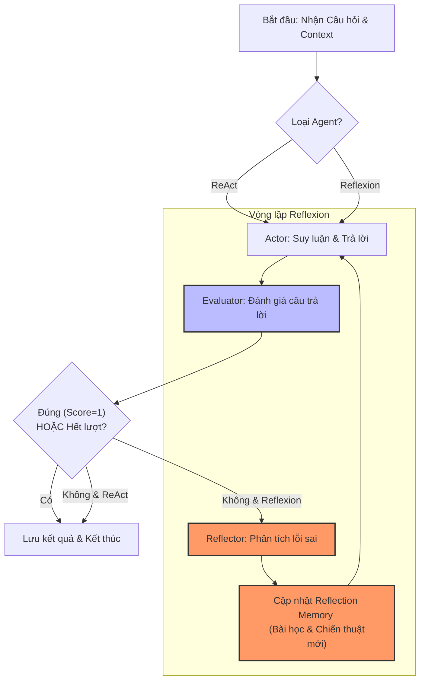

# Mermaid

```mermaid
graph TD
    A["Bắt đầu: Nhận Câu hỏi & Context"] --> B{"Loại Agent?"}
    
    B -- ReAct --> C["Actor: Suy luận & Trả lời"]
    B -- Reflexion --> C
    
    C --> D["Evaluator: Đánh giá câu trả lời"]
    D --> E{"Đúng (Score=1) <br/> HOẶC Hết lượt?"}
    
    E -- "Có" --> F["Lưu kết quả & Kết thúc"]
    
    E -- "Không & Reflexion" --> G["Reflector: Phân tích lỗi sai"]
    G --> H["Cập nhật Reflection Memory <br/> (Bài học & Chiến thuật mới)"]
    H --> C
    
    E -- "Không & ReAct" --> F
    
    subgraph "Vòng lặp Reflexion"
    C
    D
    G
    H
    end

    style G fill:#f96,stroke:#333,stroke-width:2px
    style H fill:#f96,stroke:#333,stroke-width:2px
    style D fill:#bbf,stroke:#333,stroke-width:2px
```